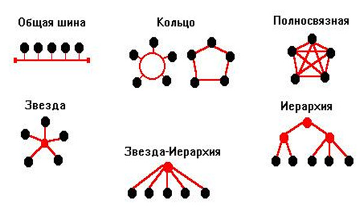
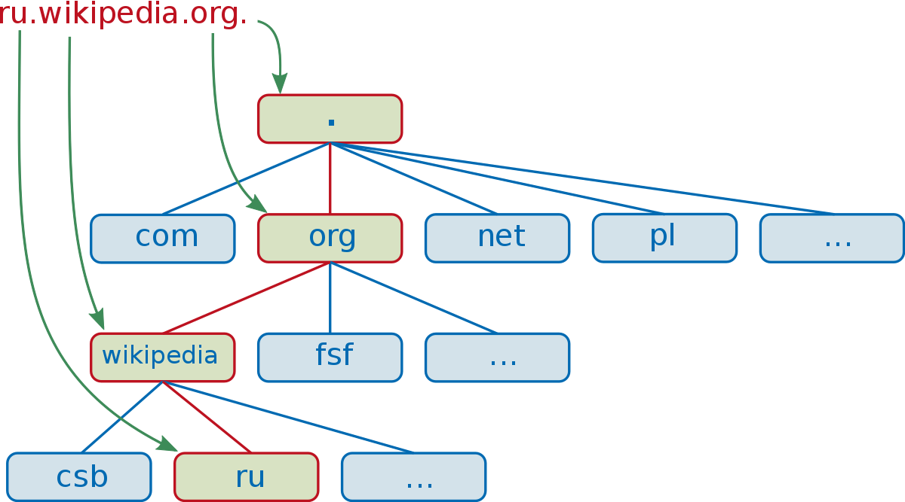

# Осваиваем Network

## Компьютерная сеть

Компьютерная сеть - это объединение нескольких компьютеров для совместного решения информационных и вычислительных задач

## Способы соединения компьютеров в сеть

Кабельные сети - среда передачи физический кабель
Беспроводные сети - среда передачи радио волны (Wi-fi, Bluetooth, 4G, LTE)

## Сетевая топология

 
Сетевая топология - это способ соединения компьютеров в сеть.
Выделяют три базовых топологии:

- **Шина**
- **Кольцо**
- **Звезда**

<b>Описание топологий Шина, Кольцо, Звезда</b>

### Шина

Шина, по этой топологии все компьютеры подсоединяются к некому общему кабелю,
является одной из старейших топологий.
Достоинства в простоте и не высокой стоимости.
Недостатки низкая надежность и проблемы совместного доступа к разделяемой среде

### Кольцо

Кольцо, по этой топологии каждый компьютер соединен с двумя другими от одного
идет только прием информации, а другому только передача, может быть вариант где не обязательно
от одного компьютера идет прием передачи, а от другого только прием. Достоинства простота,
невысокая стоимость и нет проблем с доступом к разделяемой среде. Недостатки невысокая
надежность.

### Звезда

Звезда, по этой топологии предполагается наличие дополнительного связывающего устройства,
например коммутатора к которому присоединяются абоненты. Достоинства высокая отказоустойчивость,
производительность, можно обеспечить высокий уровень безопасности. Недостатки стоимость,
единая точка отказа это маршрутизатор.

<b>Объединение сетей</b>

## Сети разной топологии можно объединять

 
Сети разной топологии можно объединять, например в офисе локальная сеть построена
на основе кольца или шины, а выход все компьютеров офиса в глобальную сеть осуществляется через
роутер и там сеть уже в виде звезды или полно связной звезды.

### Виды компьютерных сетей по размеру и территории

Виды компьютерных сетей по размеру и территории это:

- **Персональные (Personal Area Network, PAN)** - объединяют персональные устройства. Малый радиус действия и количество
  устройств.
- **Локальные (Local Area Network, LAN)** - объединяют устройства в рамках здания группы рядом стоящих зданий. Низкая
  стоимость, высокая скорость.
- **Городские (Metropolitan Area Network, MAN)** - объединяют узлы (сети) в рамках города или региона. Довольно большой
  размер сети, низкая стоимость передачи.
- **Глобальные (Wide Area Network, WAN)** - объединяет страны или континенты. Большая протяженность, огромное количество
  узлов.

## Open System Interconnection model - OSI

 
OSI - это эталонная модель взаимодействия открытых систем, которая лежит в основе всех стандартов компьютерных систем.
OSI разработана организацией ISO.
OSI является уровневой системой, она описывает:

- уровни архитектуры компьютерной сети
- вертикальные связи разных уровней одной системы
- горизонтальные связи одинаковых уровней разных систем

<b>Описание уровней модели OSI</b>

### Описание уровней модели OSI

- **Application (Прикладной)** - обеспечивает связь между приложениями, основная задача прием данных от пользователя и
  передача данных на слой ниже.
  Протоколы HTTP, FTP, SMTP, SSH и другие. 
- **Presentation (Представления)** - преобразование данных в согласованный формат и шифрование, компрессия и обратные
  операции.
  Информация о том надо ли сжимать и шифровать данные предается с уровня выше.
  Протоколы шифрования TLS, SSL. 
- **Session (Сеансовый)** - организует сеансы между устройствами. Во время сеанса (сессии) устройства могут общаться
  (посылать запросы) друг с другом много раз. 
- **Transport (Транспортный)** - разбивает данные на сегменты, добавляет свою мета информацию (заголовок) например порт,
  так же обеспечивает
  надежность передачи информации. Протоколы TCP, UDP. 
- **Network (Сетевой)** - разбивает сегменты Transport уровня на пакеты при отправке и наоборот при приеме соединяет,
  доставляет пакеты между
  разными сетями,
  например из WAN в LAN и наоборот (если необходимо передать данные между разными сетями). *Для передачи данных из одной
  сети в другую
  был введен сетевой адрес (IPv4, IPv6) с помощью IP реализуется механизм маршрутизации (Маршрутизатором) данных между
  разными сетями!*
  Протокол IP (Internet protocol). 
- **Data Link (Канальный)** - разбивает пакеты Сетевого уровня на кадры и осуществляет их доставку в пределах одной
  сети,
  осуществляется проверка доступности среды и контроль ошибок передачи (Контроль целостности кадров). Протоколы
  Ethernet, PPP, PPPoE 
- **Physical (Физический)** - реализован аппаратно, определяет физические методы передачи бит по физическим каналам 
   

### Порт

Порт в протоколах TCP, UDP это число от 1 до 65535 которое сопоставлено с конкретным запущенным экземпляром приложения
на
операционной система, с помощью порта можно иметь много разных или даже одинаковых приложений на одной машине!
Порт указывается после двоеточия 127.0.0.1:8080

<b>Передача информации согласно модели OSI в сети</b>

### Передача информации согласно модели OSI в сети

1. Application получает непосредственно данные от пользователя
2. Presentation данные преобразуются в массив байт возможно сжатие и шифрование
3. Session занимается только тем что открывает/закрывает сеанс и поддерживает его, добавляет заголовок протокола
4. Transport разбивает массив байт на сегменты и добавляет к каждому сегменту заголовок с портами приложения
5. Network разбивает сегменты на IP пакеты добавляет заголовок IP протокола
6. Data разбивает Ip пакеты на кадры добавляет заголовки с Mac адресами и т.д.
7. Physical кадры преобразуются в физическое представление байт для передачи по соответствующей физической среде
8. Байты идут по сети и могут пройти через множество сетевых узлов (роутеры и подобное) и там так же есть преобразование
   например физические сигналы с Physical идут на Data после на Network потом роутер понимает куда нужно далее отправить
   данные,
   на какой узел чтоб они дошли до получателя и проделывает обратное преобразование при этом отправив данные на нужный
   узел!
   Роутеры при преобразовании данных до Network уровня проверяют заголовок TTL и определяют нужно ли убить пакет или он
   еще живой,
   чтоб потерявшиеся пакеты не гуляли по сети вечно!
9. Physical уровень преобразует физические сигналы в кадры с байтами
10. Data проверяет кадры по контрольной сумме, если кадры валидны преобразует их в пакеты
11. Network преобразует пакеты в сегменты
12. Transport берет сегменты и склеивает их в массив байт тут в зависимости от протокола (TCP, UPD) может быть проверка
    сегментов
13. Session решает поддерживать ли сеанс далее
14. Presentation если нужно расшифровывает массив байты или делает декомпрессию
15. Application представляет массив байт в виде данных 
     

## TCP/IP (Transmission Control Protocol/Internet Protocol)

Модель OSI это хорошая теоретическая модель для построения сетей, но многие протоколы и уровни из нее не используются на
практике, на практике широкое распространение получила модель TCP/IP основанная на **4 уровнях** и использовании
протоколов TCP и IP. 
**OSI vs TCP/IP** 

 
 

<b>Уровни модели TCP/IP</b>

- **Application (Прикладной)** - здесь работают приложения, установленные на компьютере, телефоне или сервере.
  Но в отличие от модели OSI здесь же происходит согласование данных (шифрование, сжатие, выбор формата данных и выбор
  кодеков) и установка сеансов связи.
  Например, здесь работают протоколы SIP, DHCP, HTTP и подобные.
- **Transport (Транспортны)** - не отличается от транспортного уровня в модели OSI.
  Здесь также работают 2 протокола: TCP и UDP. А в качестве служебной информации выступают сетевые порты.
- **Network (Сетевой)** - не отличается от сетевого уровня модели OSI.
  Здесь реализуется IP-адресация и маршрутизация, за счет введения IP-адресов.
- **Network Interface (Сетевой интерфейс)** - вобрал в себя физический и канальный уровни модели OSI.
  Это аппаратный уровень, на котором работают сетевые карты, коммутаторы, повторители, концентраторы.
  Также на этом уровне находятся среды передачи информации, провода, радиоволны. Но не просто среды, а технологии,
  которые эти среды используют: Ethernet, Wi-Fi, DSL, Bluetooth.
  Также на этом уроне можно обнаруживать или исправлять ошибки, возникшие при передаче данных.

## IPv4

IPv4 - это 32 битное число которое принято записывать в виде четырех октетов размером 8 бит (0-255) через точку.
Пример 192.168.1.1

<b>Структура пакета IPv4</b>

### Структура пакета IPv4

 
 
Каждый сегмент в пакете равен 4 байтам, так как на момент создания протокола процессоры были 32 битные и процессорное
слово равнялось 4 байтам! 
**Слова:**

- **Version (Версия)** - обозначает версию протокола IPv4 или IPv6
- **IHL (Размер заголовка)** - размер заголовка, вводился для поля Options, равен 20 байт, **не используется**
- **TOS ()** - состоит из двух полей DSCP и ECN
- **Total length (Полный размер)** - полный размер всего IP пакета (максимальное значение 65535 байт)
- **Identification (Идентификатор, для фрагментации)** - идентификатор пакета, используется при фрагментации большого
  пакета на куски,
  у всех кусков будет один и тот же идентификатор
- **Flags (флаги)** - некоторые флаги которые используются для контроля над фрагментацией пакета, например, где
  начинается пакет и подобное.
- **Fragmentation Offset (Сдвиг фрагментации)** - сдвиг фрагментации говорит на сколько байт относительно 0 нужно
  выполнить
  смещение, если конечно пакет был фрагментирован.
- **TTL (время жизни пакета)** - определяет максимальное количество узлов через которое может пройти пакет, чтобы пакет
  не блуждал
  по сети вечно в случае его потери
- **Protocol (протокол)** - указывает протокол верхнего уровня, например TCP - это 00000110, ГВЗ - 00010001
- **Header Checksum (чек сумма заголовка)** - проверяет только целостность заголовка. (IP протокол сам не умеет
  определять
  целостность данных за него это делают протоколы верхних уровней!)
- **Source Address (адрес источника)** - нужен только принимающей стороне, что бы знать куда слать ответ
- **Destination Address (адрес назначения)** - маршрутизаторы смотрят сюда при принятии решения куда направить пакет.
- **Options (опции)** - не используется сейчас

<b>Пример фрагментации пакета</b>

## Пример фрагментации пакета

Например сеть Х передает сети Y пакет в 10000 байт, на что сеть Y отвечает что максимум может принять пакет в 3000 байт,
тогда пакет будет разбит на серию мелких пакетов. 
Смещение (Fragmentation Offset) считается как размер пакета деленное на 8 (бит в байте).
Например для первого пакета 2480/8 = 310 
 

## IPv6

IPv6 - это 128 битное число которое принято записывать в виде восьми шестнадцатеричных чисел через двоеточие.
Пример 2001:0db8:0000:000:0001:ff00:0042:7756
IPv6 разработан в связи с тем что количество устройств в сети больше чем может быть в IPv4.

## Frame (Кадр)

На Канальном уровне пакеты с Сетевого уровня разбиваются на кадры.

<b>Состав Кадра</b>

Frame (Кадр) - представляет последовательность упорядоченных байт информации и включает в себя:

- **Preamble (Преамбула)** - байты использующиеся на аппаратном уровне для синхронизации 
- **Start-Frame Delimiter (Начало кадра)** - указывает начало кадра 
- **Source address (Адрес отправителя)** - Mac адрес отправителя 
- **Destination address (Адрес назначения)** - Mac адрес получателя 
- **Type/Length ()** - идентификатор протокола верхнего уровня, или длина 
- **Data ()** - обычно данные из пакета сетевого уровня 
- **Заполняющие байты** - не обязательное поле для заполнения фиктивными байтами 
- **Frame Check Sequence (Контрольная сумма)** - контрольная сумма для проверки целостности кадра 
   

## Mac-адрес

На Канальном уровне появляется понятие Mac-адрес - это уникальный аппаратный адрес который прошит в каждой сетевой
крате устройства (коммутатор, маршрутизатор, сетевая карта, wi-fi модуль). 
Mac-адрес это 48 битное число разбиваемое на 6 октетов разделенных двоеточием.
Пример: 28:cf:de:05:ee:08

## Netmask (Сетевая маска или Маска подсети)

Сетевая маска это 32 битное число.
Сетевая маска используется для определения сети в которой находится узел получатель, так как его IP адреса для этого не
достаточно.
В Ipv4 сетевая маска обозначается как netmask в случае с Ipv6 сетевая маска обозначается как prefixlen 64 
Для того что бы понять в какой сети получатель используется побитовое и IP адреса получателя с его маской сети!

<b>Указание бит маски в IP адресе</b>

IPv4 при написании IP адреса можно указать и биты которые отвечают за определение сети, то есть маску, делается это через /.
Пример 192.168.123.1/16 это значит что маска 255.255.0.0 
IPv6 маску указывают как prefixlen 64 это значит что 8 первых бит используется для определения сети

<b>Пример нахождения сети и адреса устройства в ней</b>

 
Имеем:
 - IP адрес 192.168.123.132
 - netmask 255.255.255.0
 - Через побитовое И Ip адреса и netmask получаем Сеть 192.168.123 Так как netmask идет до 3 октета то, и адрес сети то же будет до 3 октета
 - Адрес устройства в сети найденной на шаге выше определяется результатом побитового И Ip адреса и netmask в оставшихся октетах, 
в нашем случает это 4 октет, и того адрес устройства это 132

## DNS

Domain name system (Система доменных имен) - распределенная система в которой информация о соответствии host name и IP
адреса
сайта хранится на большом количестве связанных между собой DNS-серверов. 
Каждый DNS-сервер хранит информацию о доменах только своей зоны, но так как DNS-сервера связаны между собой то можно
получить
IP адрес сайта из любой зоны! 
DNS предполагает что все компьютеры в сети разделяются на логические группы - **домены**,
при этом доменные имена образуют иерархическую структуру, то-есть один домен может быть частью другого.
Структура делится на домены первого, второго и т.д. уровня.

<b>Иерархическая структура доменов</b>

Пример иерархической структуры доменного имени сайта.
Для получения IP адреса сайта по его host name  ru.wikipedia.org нам необходимо пройтись по нескольким DNS серверам отвечающим
за свой домен пока мы не дойдем до DNS сервера домена ru и там не найдем IP адрес этого сайта 
 

### Host name

Host name (Имя хоста) - представляет понятный и хорошо запоминающийся человеку текст связанный с IP адресом
сайта (google.com).
С host name может быть связано один или несколько IP адресов, и так же с каждым IP адресом может быть связано одно или
несколько
доменных имен.
**Для связи host name сайта и его IP адреса есть два способа:**

- (Устарел) Использовать файл hosts, в нем хранятся пары соответствий host name против IP адреса сайта
- Использовать службу DNS

## HTTP протокол

HTTP (hyper text transfer protocol) - это протокол передачи произвольных данных **прикладного уровня**, изначально
разрабатывался для передачи html. В настоящее время по http предают любые данные. 
HTTP протокол соответствует **клиент серверной архитектуре запрос ответ**. 

<b>Клиент серверная архитектура запрос ответ</b>

 

Клиент серверная архитектура подразумевает выделение двух основных компонентов, клиента и сервера.
Клиент это потребитель ресурсов сервера, как правило, это пользовательское приложение или браузер.
Сервер это приложение предоставляющее некоторые возможности клиенту. 
С точки зрения http взаимодействие клиента и сервера производится по шаблону запрос ответ, это значит
что клиент инициирует открытие соединения с сервером отправку соединение ожидание ответа и закрытие соединения.
Одно соединение делается в рамках одного ответа. Так же есть web socket подразумевающий много запросов в рамках одного
соединения.
 

<b>Основные части HTTP запроса или ответа</b>

Каждый http запрос или ответ всегда имеет три основные **логические** части:

1) Стартовая строка
2) Заголовок (header)
3) Тело сообщения (body)

Структура запроса и ответа 

Для запроса:

- Стартовая строка содержит, указание метода (GET), далее указан путь, а после идет версия http протокола
- Заголовки запроса
- Пустая строка между заголовками и телом запрсоа
- Тело запроса
  Для ответа:
- Стартовая строка содержит версию http протокола, статус ответа на запроса
- Заголовки ответа
- Пустая строка между заголовком и телом
- Тело ответа

<b>HTTP коды ответов</b>

Существует 5 классов состояния ответов:

- 1ХХ - Информация о состоянии процесса передачи (101 Switching Protocols используется для работы на web socket)
- 2ХХ - Успешное принятие запроса и его обработка (201 - что-то было создано)
- 3ХХ - Необходимо выполнить запрос по другому URL указанному в заголовке location
- 4ХХ - Ошибка на стороне клиента (404 - нет такого ресурса)
- 5ХХ - Ошибка на стороне сервера (503 - сервер не доступен)

<b>HTTP заголовки</b>

Заголовок (Header) характеризует тело сообщения (body) и параметры его передачи, представляется в виде
"header_name:header_value", по сути заголовки это метаинформация. Имена заголовков чувствительны к регистру! 
Например:

- Authorization: содержит авторизационные данные
- content-type: тип данных который содержит http сообщение (Есть в сообщениях с телом)
- accept: тип данных который ожидается в ответе на запрос (Есть в сообщениях ждущих ответ)

<b>HTTP тело</b>

В теле передаются непосредственно пересылаемые данные. Тело отделяется от заголовков пустой строкой! 
При наличии в http сообщении тела, сообщение обязательно должно иметь два заголовка, content-type - обозначает
тип данных в теле, accept - тип данных который ожидает получить в ответ сторона сделавшая http запрос.

<b>MIME type</b>

[MIME type][mime_type_link] - используется для указания типа данных в теле http сообщения, в заголовках content-type,
accept. 
[Все существующие media types](https://www.iana.org/assignments/media-types/media-types.xhtml)
MIME type выглядит так type/subtype;parameter=value, где:

- type - основной тип данных (application - это бинарный тип данных)
- subtype - подтип основного типа (json - подтип application говорит о том что данные в формате json)
- parameter - метаданные о данных (например кодировка текста)

[mime_type_link]: https://developer.mozilla.org/en-US/docs/Web/HTTP/Basics_of_HTTP/MIME_types

<b>HTTP методы</b>

HTTP методы передаются в стартовой строке запроса, и логически обозначают тип операции которая должна быть выполнена.

<b>Структура URL</b>

Для https стандартный порт 443 при https его можно не указывать. 
Для http стандартный порт 80 при http его можно не указывать.

## HTTP 2.2

Документация по HTTP 2.2 на русском [http2 explained
](https://http2-explained.haxx.se/ru/part6)

<b>История http (Hyper text transfer protocol)</b>

- HTTP/0.9 - первый стандарт HTTP выпущенный в 1991
    - самый простой протокол выпущенный с одним методом GET /index.html возвращавшим html страницу
- HTTP/1.1 - выпущен в 1996
    - Работа с разными форматами данных: видео, изображения, текст и т.д.
    - Новые HTTP-методы: POST и HEAD
    - Добавлены заголовки (headers) в запрос и ответ
    - Появились коды состояний (1хх, 2хх, .., 5хх) 
- HTTP 1.1 - выпущен в 1999
    - Новые HTTP-методы: PUT, PATCH, DELETE, OPTIONS
    - Клиентский cookie (заголовки Cookie и Set-Cookie)
    - Кеширование (заголовок Cache-Control)
    - Постоянное соединение (для закрытия соединения в запросе использовался заголовок Connection: close)
    - Потоковая передача данных (несколько запросов в рамках одного соединения) (для определения конца ответа сервера
      использовался заголовок Content-Length)
- HTTP 2.0 - выпущен в 2015
    - Бинарный а не текстовый как предыдущие
    - Мультиплексирование (одно TCP соединение может обрабатывать несколько асинхронных запросов)
    - Server Push (несколько ответов на один запрос)
    - Сжатие заголовков методом HPACK
    - Приоритизация запросов
    - Безопасность

**запрос/ответ http 0.9** 
<code>GET /index.html HTTP/0.9  
&lt;HTML&gt;This is the content of the index.html document.&lt;/HTML&gt;</code> 

**запрос http 1.0** 
<code>GET /image.jpg HTTP/1.0  
Host: www.example.com 
User-Agent: Mozilla/5.0 (Windows NT 10.0; Win64; x64)  
&lt;HTML&gt;This is the content of the index.html document.&lt;/HTML&gt;</code> 

**ответ http 1.0** 
<code>HTTP/1.0 200 OK  
Date: Sunday, 28 July 2024 12:01:15 GMT 
Server: Apache/2.4.6 (Ubuntu) 
Content-Type: image/jpeg 
Content-Length: 4000  
&lt;Binary data representing the image&gt;</code> 

> !IMPORTANT
> - Главный недостаток http 1.0 это отправка только одного запроса в рамках одного TCP соединения
> - В http 1.0 протокол не хранил состояний, и вся информация передавалась в заголовках запроса и ответа, информация
    часто дублировалась
> - В http 1.1 не всегда была возможность потоковой передачи данных (не возможно передать в ответе заголовок
    Content-Length,
    если сервер не может оценить объем данных)
> - Так как клиент в http 1.1 в рамках одного TCP соединения мог отправлять множество запросов, сервер обрабатывал их по
    очереди,
    и самый медленный запрос в начале очереди определял общее время обработки последующих запросов

**Работа разных версий протокола http**
 
[Источник картинки](https://xtech.nikkei.com/atcl/nxt/column/18/01842/041800060/)

## HTTP 2.0

<b>HTTP 2.0 основные новшества</b>

### Бинарный протокол

HTTP 2.0 передает данные в бинарном виде, бинарные сообщения разбираются автоматически представляя из себя фреймы (
Frames)
и потоки (Streams), единственное бинарный протокол не так понятен для человека. Переход на бинарный формат вызван
потребностью
решить проблему выросшей задержки (latency) данных. 
Latency - это время между началом запроса от клиента к серверу и ответом

### Frames and Streams

В http 2.0 сообщение физически делится на две части (фрейма) фрейм заголовков и фрейм данных, в http 1.1 сообщение было
едиными и логически делилось на 3 части. 
Виды фреймов: HEADERS, DATA, RST_STREAM, PUSH_PROMISE, PRIORITY и другие. 
Фреймы и потоки позволяют пользоваться мультиплексированием запросов и ответов, но и позволяют клиенту и серверу
общаться асинхронно!
> !IMPORTANT
> - Данные в фреймах представлены в бинарном виде!
> - Каждый фрейм имеет id потока (stream)

 

Stream - это коллекция фреймов, потоки двунаправлены.
> !IMPORTANT
>  - Каждый клиентский запрос использует нечетный id, а ответ от серва четный id 
      

> !IMPORTANT
>  - Благодаря бинарному представлению даных в виде фреймов и потоков, **клиент и сервер могут общаться асинхронно**
     использую лишь одно TCP соединение (Это решает проблему блокировки очереди запросов долгим запросом в HTTP 1.1)

### Sever Push

Механизм в HTTP 2.0 подразумевающий что сервер зная что клиент запросит определенный ресурс, может сам отправить его не
дожидаясь
запроса.
Для этого сервер отправляет специальный фрейм PUSH_PROMISE с таким же id, что и запрос клиента 
 
[Статья источник картинки](https://blog.cloudflare.com/announcing-support-for-http-2-server-push-2/)
При использовании HTTP 1.1 клиент отправил бы 3 запроса на сервер: первый для получения page.html, второй для получения
style.css,
и третий для получения image.png, все запросы выполнялись бы по очереди! 
При использовании HTTP 2.0 с server push клиент открыл соединение с сервером отправил один запрос на серве для получени
page.html
далее сервер зная что клиенту скорее всего понадобятся и style.css и image.png отправил и их в ответ, для каждого
файла (ресурса)
сервер отправил фрейм PUSH_PROMISE
Процесс показан на картинке ниже 
 

### Сжатие заголовков методом HPACK

Формат сжатия заголовков в HTTP 2 состоит из трех основных частей:

1) Статическая таблица - **общая для всех TCP соединений** и содержит 61 часто используемый заголовок, из документации
   протокола
2) Динамическая таблица - **создается для каждого TCP соединения** (<u>Будет активно использоваться и имеет смысл когда
   в рамках одного TCP соединения делается несколько запросов</u>)
   и содержит используемые заголовки во время обмена сообщениями (ограниченного размера)
3) Сжатие заголовков алгоритмом Хаффмана

 

<b>Несколько запросов в рамках одного TCP соединения и их сжатие заголовков</b>

 
 

> !IMPORTANT
> Все имена заголовков в HTTP 2 с маленькой буквы
> Динамическая и статическая таблица дают выйгрыш за щет того что часто используемые заголовки и их значения не нужно
> каждый раз
> кодировать достаточно указать их как ссылку на поле из динамической или статической таблицы

### Приоритизация потоков

Клиент может назначить приоритет потоку (Stream), для этого он должен добавить число от 1 до 256 в фрем HEADERS, или
обновить
уже существующий поток с помощью фрейма PRIORITY 
> !IMPORTANT
> Так же каждому потоку может быть дана явная зависимость от другого потока, что совместно с приоритетом представляет
> собой "дерево приоритетов"
>  

### Безопасность

Большая часть клиентов поддерживает HTTP 2 только если он используется поверх TLS (то-есть используется HTTPS),
за счет улучшений http 2 количество рукопожатий по tls будет меньше

